# Digital Banking Frontend

A modern, responsive web application built with Angular 19 for digital banking services. This application provides a comprehensive interface for both customers and administrators to manage banking operations, accounts, and user profiles.

## Backend project: [DigitalBankingBackEnd](https://github.com/ANZER03/DigitalBankingBackEnd)

## Project Overview

This Digital Banking Frontend application is designed to provide a seamless banking experience with the following features:

- **User Authentication**: Secure login system with JWT authentication
- **Customer Management**: Add, view, and manage customer information
- **Account Management**: Create and manage different types of bank accounts
- **Dashboard**: Visual representation of banking data and statistics
- **Profile Management**: User profile viewing and editing capabilities
- **Role-based Access Control**: Different views and permissions for customers and administrators

## Technology Stack

- **Framework**: Angular 19
- **UI Components**: PrimeNG 19
- **Styling**: Tailwind CSS with PrimeNG UI integration
- **Charts**: Chart.js for data visualization
- **Authentication**: JWT-based authentication
- **State Management**: RxJS for reactive programming

## Project Structure

```
digital-banking-front-end/
├── src/
│   ├── app/
│   │   ├── Components/           # UI components
│   │   │   ├── account/          # Account management components
│   │   │   ├── admin/            # Admin dashboard components
│   │   │   ├── customer/         # Customer management components
│   │   │   ├── dashboard/        # Main dashboard components
│   │   │   ├── login/            # Authentication components
│   │   │   ├── new-account/      # Account creation components
│   │   │   ├── new-customer/     # Customer creation components
│   │   │   ├── not-authorize/    # Authorization error components
│   │   │   └── profile/          # User profile components
│   │   ├── guards/               # Route guards for authentication/authorization
│   │   ├── interceptors/         # HTTP interceptors
│   │   ├── models/               # Data models/interfaces
│   │   ├── services/             # API and business logic services
│   │   ├── app.component.ts      # Root component
│   │   ├── app.routes.ts         # Application routing
│   │   └── theme.config.ts       # UI theme configuration
│   ├── assets/                   # Static assets
│   ├── environments/             # Environment configurations
│   ├── index.html                # Main HTML file
│   └── styles.scss               # Global styles
├── angular.json                  # Angular configuration
├── package.json                  # Dependencies and scripts
├── tailwind.config.js            # Tailwind CSS configuration
└── tsconfig.json                 # TypeScript configuration
```

## Getting Started

### Prerequisites

- Node.js (v18 or higher)
- npm (v9 or higher)

### Installation

1. Clone the repository:
   ```bash
   git clone https://github.com/ANZER03/DigitalBankingFrontEnd.git
   cd digital-banking-front-end
   ```

2. Install dependencies:
   ```bash
   npm install
   ```

3. Start the development server:
   ```bash
   npm start
   ```

4. Open your browser and navigate to `http://localhost:4200/`

## Development

### Development server

To start a local development server, run:

```bash
ng serve
```

Once the server is running, open your browser and navigate to `http://localhost:4200/`. The application will automatically reload whenever you modify any of the source files.


### Running end-to-end tests

For end-to-end (e2e) testing, run:

```bash
ng e2e
```

Angular CLI does not come with an end-to-end testing framework by default. You can choose one that suits your needs.

## Demo

Below are screenshots demonstrating the key features of the Digital Banking Frontend application:

### Login Screen
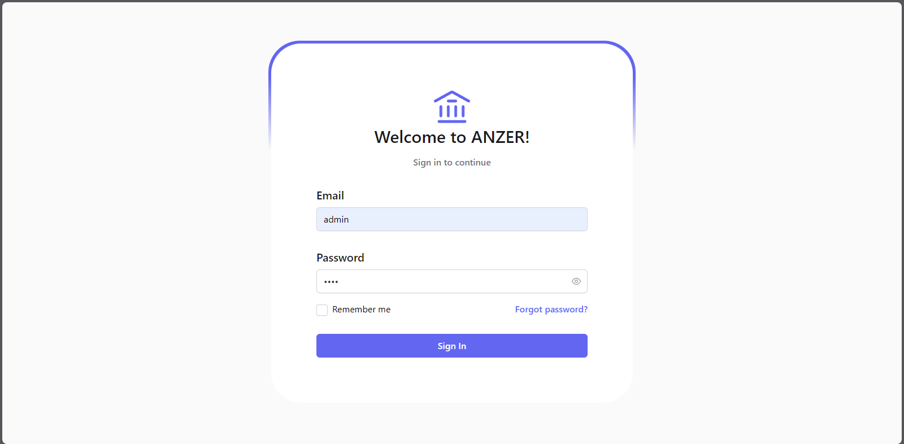
*The login interface where users authenticate to access the banking system.*

### Customer Management
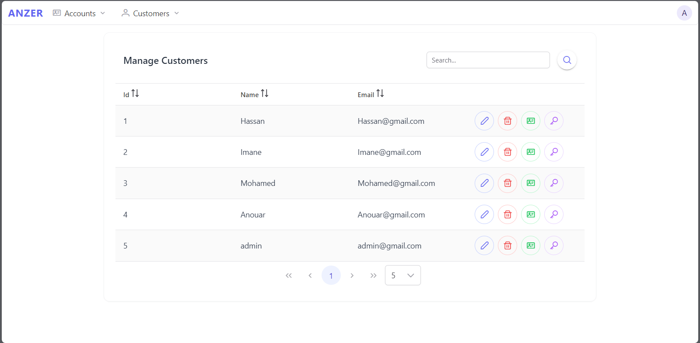
*Interface for viewing and managing customer information.*

### Customer Creation
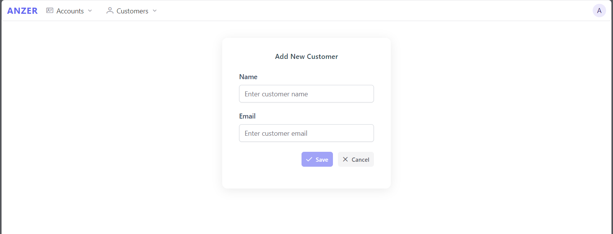
*Form for creating new bank customer.*

### Update Profile
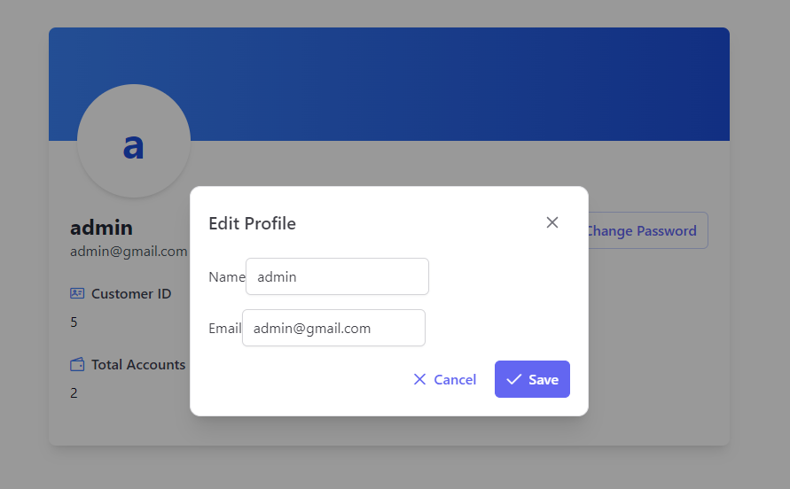
*Form for updating bank customer infos.*

### Update Password
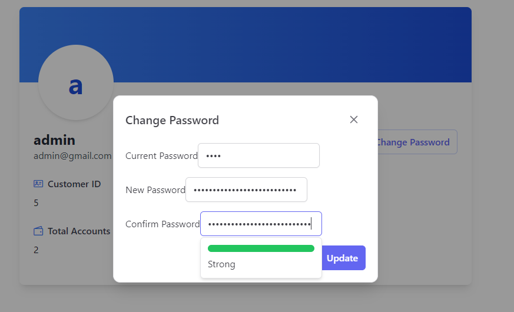
*Form for updating bank customer infos.*

### Account Creation
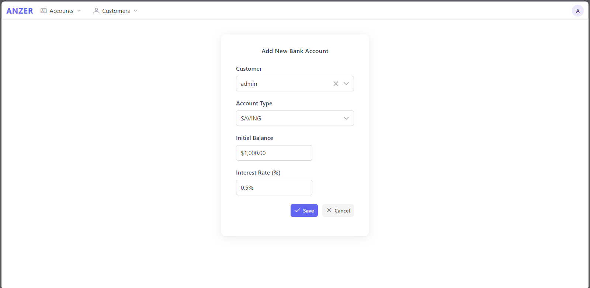
*Form for creating new bank account for customer.*

### Customer Accounts
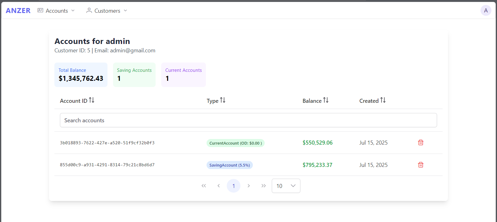
*View showing all accounts associated with a specific customer.*

### Search Account
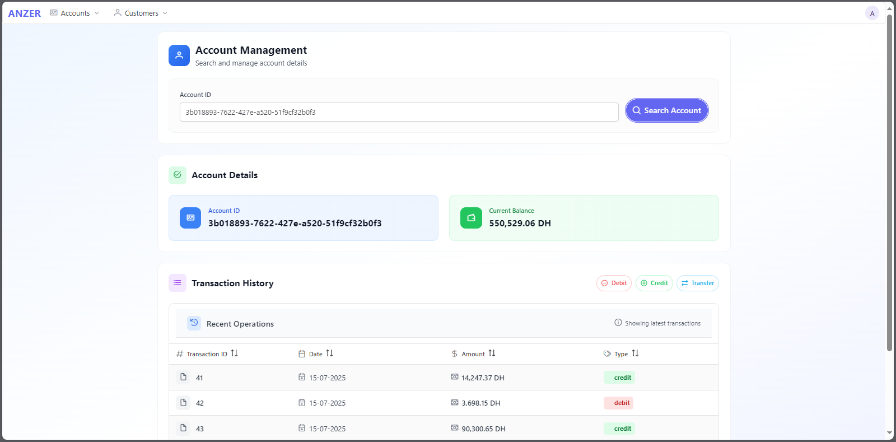
*Form for search bank account.*

### Transaction Operations
#### Debit Form
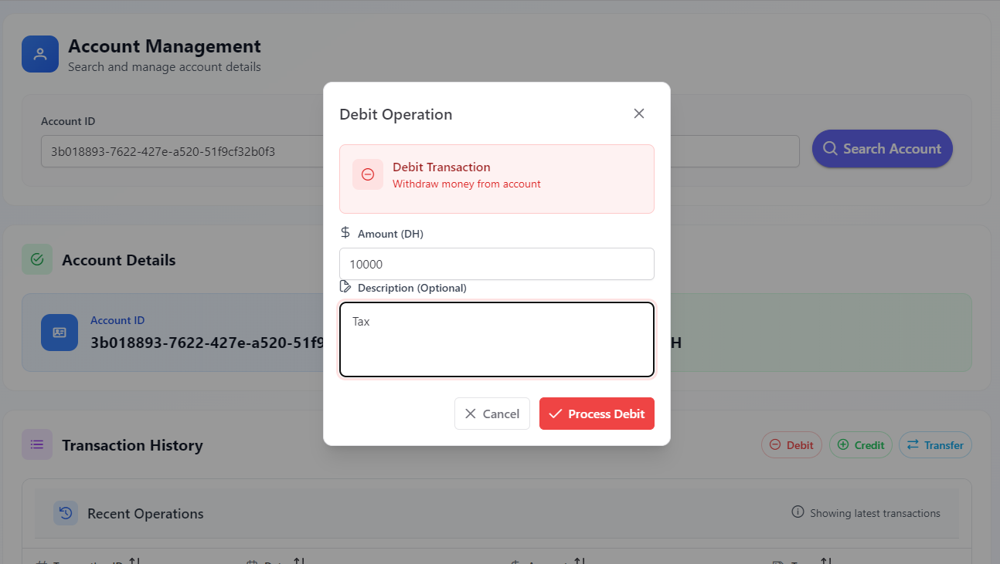
*Interface for performing debit operations from customer accounts.*

#### Credit Form
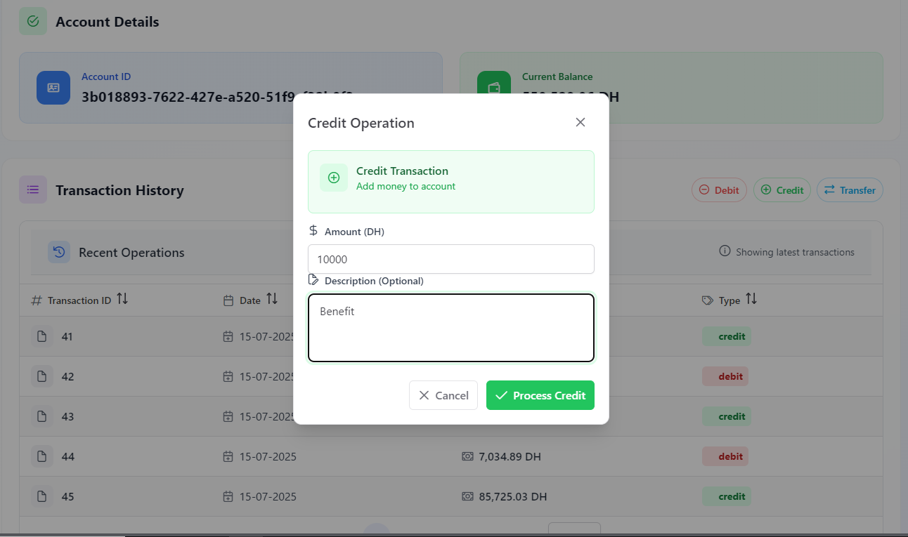
*Interface for performing credit operations to customer accounts.*

#### Transfer Form
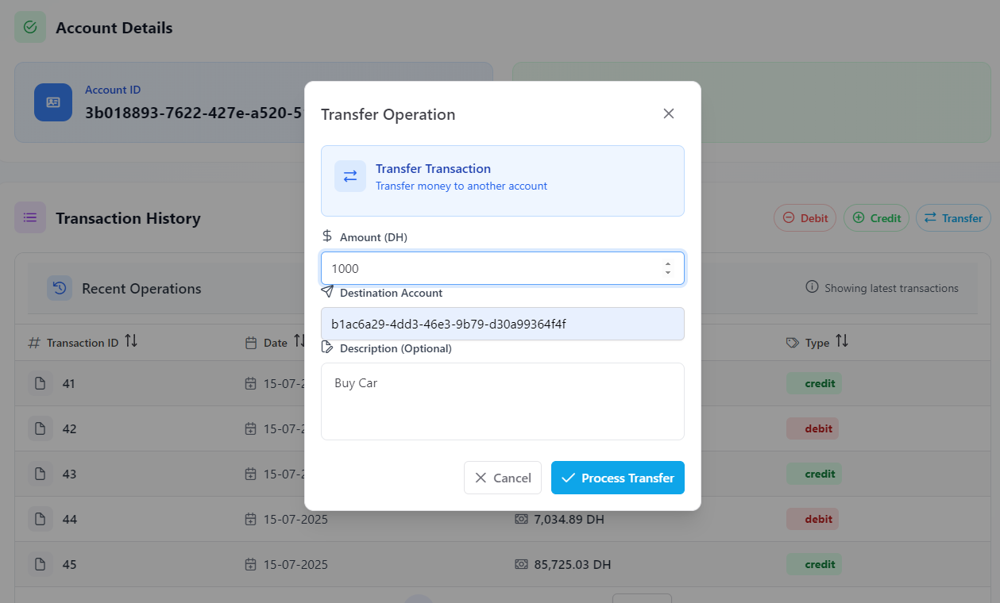
*Interface for transferring funds between accounts.*

### Profile Management
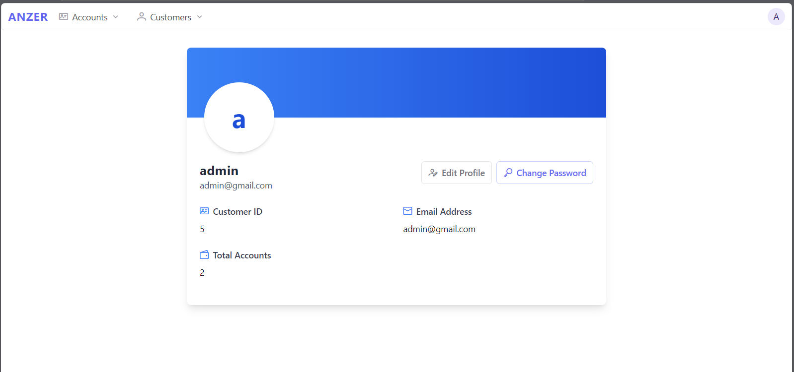
*User profile interface for viewing and editing personal information.*

### Banking Analytics
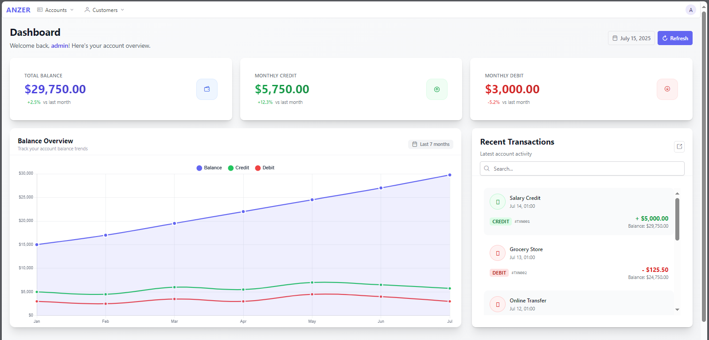
*Visual representation of banking data and statistics using charts.*